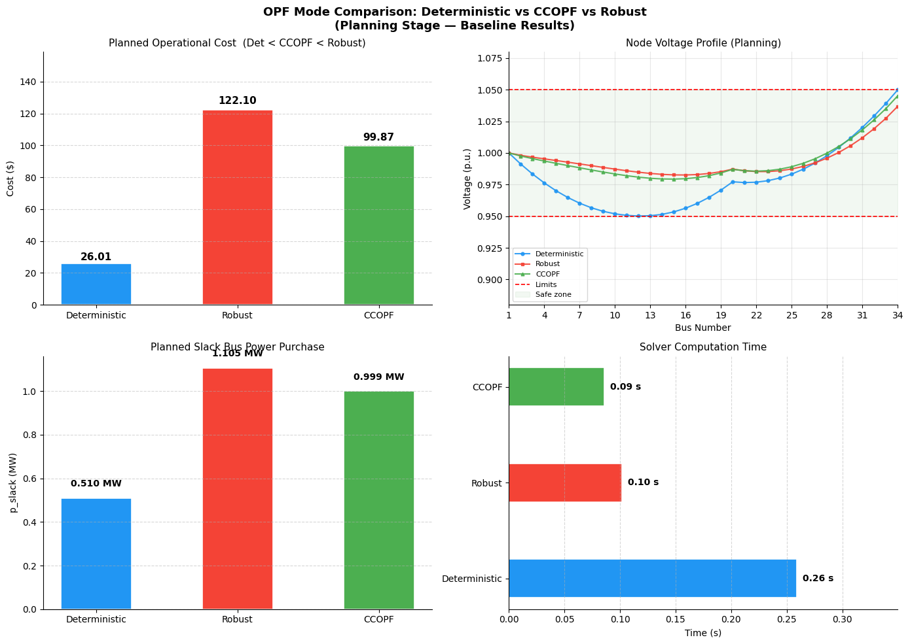
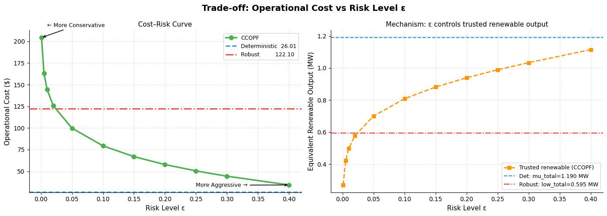
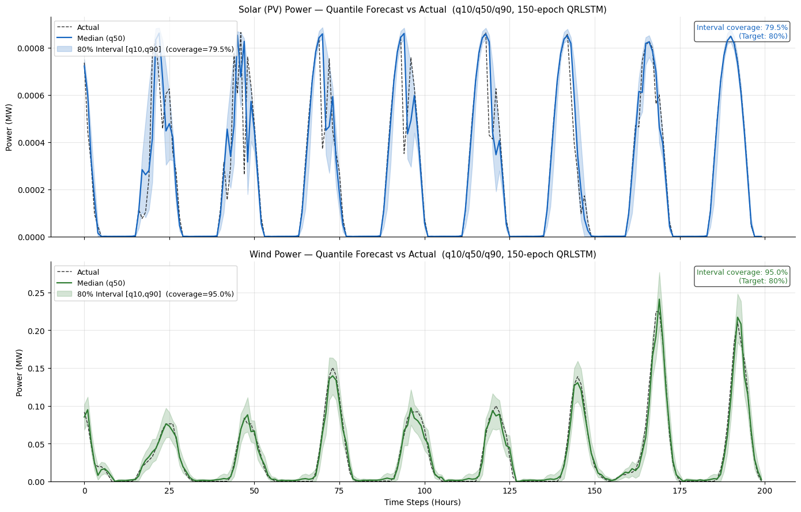
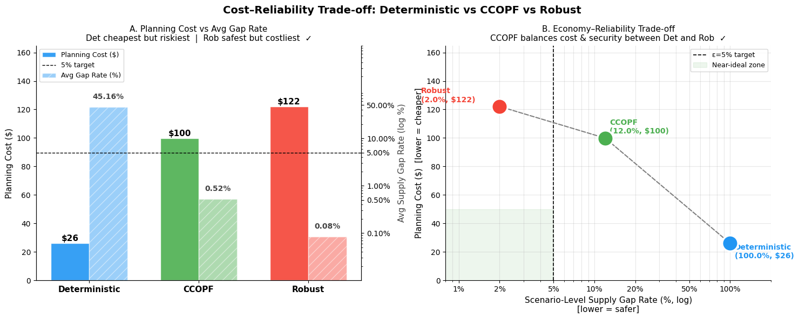
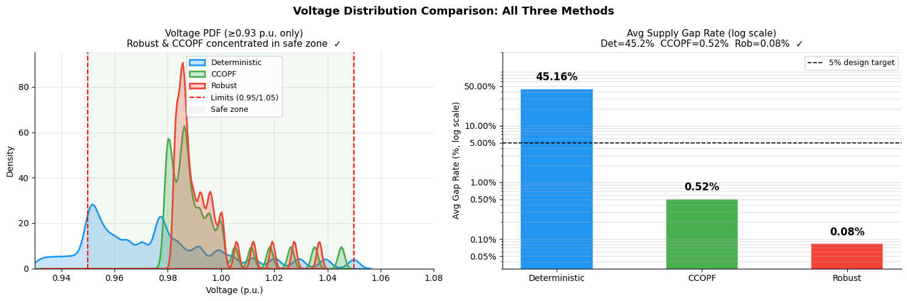

# Stochastic OPF — IEEE 34-bus

> **QR-LSTM Quantile Forecasting + DistFlow-SOCP Stochastic Optimal Power Flow**
>
> Comparing three planning strategies — **Deterministic / CCOPF / Robust** — on economy and supply reliability under renewable energy uncertainty.

---

## Results Preview

### 1. Monte Carlo Voltage Distribution & Supply Gap Rate



**Figure 1 — Monte Carlo Validation: Voltage PDF & Gap Rate (500 scenarios × 24 h)**

**Left — Voltage PDF (≥ 0.93 p.u.):** Across all 12,000 scenario-hours, Deterministic (blue) spreads widely with a long left tail reaching below 0.95 p.u. — unsafe operating conditions. CCOPF (green) and Robust (red) concentrate sharply near 0.98–1.00 p.u., staying well within the safe zone [0.95, 1.05] p.u.

**Right — Avg Supply Gap Rate (log scale):** The fraction of hours where actual demand exceeds the planned supply cap:
- **Deterministic: 45.16%** — nearly half of all hours see shortfalls.
- **CCOPF: 0.52%** — well below the 5% design target (dashed line), meeting real-world reliability standards.
- **Robust: 0.08%** — near-zero shortfalls; extremely conservative.

---

### 2. OPF Planning Stage Comparison



**Figure 2 — Planning-Stage OPF Comparison: Deterministic vs. CCOPF vs. Robust**

Four sub-panels summarise the single-scenario (baseline) OPF solve:
- **Top-left (Planning Cost):** Deterministic costs only **$26**, CCOPF **$100**, Robust **$122** — a direct consequence of how much renewable output each strategy "trusts."
- **Top-right (Node Voltage Profile):** Deterministic voltages dip below the 0.95 p.u. lower limit at mid-network buses (10–16), while CCOPF and Robust stay safely within the [0.95, 1.05] p.u. band throughout.
- **Bottom-left (Slack Bus Power):** Robust purchases **1.105 MW** from the grid (worst-case hedge), CCOPF **0.999 MW**, and Deterministic only **0.510 MW** (optimistic, under-buys).
- **Bottom-right (Solver Time):** All three modes solve in under **0.30 s**; CCOPF is fastest at **0.09 s**, Robust **0.10 s**, Deterministic **0.26 s**.

---

### 3. CCOPF Cost–Risk Sweep (ε Trade-off)

<table>
<tr>
<td width="50%">



</td>
<td width="50%">

**Figure 3 — Operational Cost vs. Risk Level ε**

The left panel shows the **cost-risk curve** as ε is swept from 0.01 to 0.40. At ε → 0 (near-zero tolerated shortfall probability), CCOPF cost (~$205) far exceeds the Robust baseline ($122), because the chance constraint tightens past the worst-case bound. As ε grows, cost falls steeply, crossing the Robust line (~ε = 0.03) and approaching Deterministic at high ε.

The right panel reveals the **mechanism**: trusted renewable output (orange) rises from ~0.40 MW at ε = 0.01 to ~1.15 MW at ε = 0.40, converging toward the Deterministic mean (blue dashed, 1.190 MW) and away from the Robust lower bound (red dash-dot, 0.595 MW). **CCOPF at ε = 0.05** strikes a practical balance: cost ≈ $100 with gap rate ≈ 0.52%.

</td>
</tr>
</table>

---

### 4. QR-LSTM Quantile Forecasting

<table>
<tr>
<td width="50%">



</td>
<td width="50%">

**Figure 4 — QR-LSTM Probabilistic Forecast (150 epochs, q10/q50/q90)**

Solar (PV, top) and Wind (bottom) power forecasts over ~200 test hours. The shaded band is the 80% prediction interval [q10, q90]; the solid line is the median forecast (q50); the dashed line is actual output.

- **Solar coverage: 79.5%** — closely matches the 80% design target, confirming well-calibrated uncertainty bounds for PV.
- **Wind coverage: 95.0%** — conservatively wide intervals safely bracket real wind variability, at the cost of slightly over-estimating uncertainty.

The LSTM captures the diurnal on/off pattern of solar and the irregular peaks of wind, with quantile intervals that widen appropriately during high-output periods.

</td>
</tr>
</table>

---

### 5. Cost–Reliability Trade-off Summary

<table>
<tr>
<td width="50%">



</td>
<td width="50%">

**Figure 5 — Cost–Reliability Trade-off: Deterministic vs. CCOPF vs. Robust**

**Left (Panel A):** Side-by-side comparison of planning cost (solid bars) and average gap rate (hatched bars, right axis, log scale). Deterministic is cheapest ($26) but incurs a 45.16% shortfall rate. CCOPF ($100) reduces the gap rate by ~87× to 0.52%. Robust ($122) nearly eliminates shortfalls (0.08%) but at the highest cost.

**Right (Panel B — Economy–Reliability Frontier):** A Pareto scatter on log-scale gap rate vs. planning cost. CCOPF (green) sits in the near-ideal zone — left of the 5% ε target (dashed line) and well below Robust's cost. Deterministic (blue) is cheapest but lies far right (unsafe). Robust (red) is safest but most expensive. **CCOPF dominates on the cost-reliability trade-off for practical distribution network operation.**

</td>
</tr>
</table>

---

## Background

Modern distribution networks with high penetration of solar and wind face significant output uncertainty. This project builds a complete pipeline:

1. **QR-LSTM** forecasts solar and wind power with uncertainty intervals (q10/q50/q90)
2. **DistFlow-SOCP OPF** (Pyomo + IPOPT) solves optimal power flow under three uncertainty handling strategies
3. **Monte Carlo validation** (500 scenarios × 24 hours) evaluates each strategy's real-world reliability

Two network cases are provided: a **simplified** uniform-parameter 34-bus and the **true** IEEE 34-bus with realistic impedances.

---

## Project Structure

```
stochastic-opf-ieee34/
├── src/
│   ├── __init__.py
│   ├── dataset.py          # Weather data loading, physical modelling, leak-free split
│   ├── model.py            # QRLSTM model + quantile loss
│   ├── train.py            # Training loop
│   ├── opf_simple.py       # Simplified 34-bus OPF (uniform parameters)
│   ├── opf_true.py         # True IEEE 34-bus OPF (realistic parameters)
│   ├── monte_carlo.py      # Vectorised Monte Carlo validation (no OPF calls)
│   └── utils.py            # Visualisation + result saving
├── configs/
│   ├── simple_ieee34.yaml  # Parameters for simplified case
│   └── true_ieee34.yaml    # Parameters for true IEEE 34-bus case
├── scripts/
│   ├── run_simple.py       # One-click runner: simplified case
│   └── run_true.py         # One-click runner: true case
├── notebooks/
│   ├── 01_Simple_IEEE34_Demo.ipynb
│   └── 02_True_IEEE34_Case.ipynb
├── data/                   # Place weather CSV files here (not committed)
├── results/
│   ├── figures/            # Auto-saved plots
│   └── logs/
│       └── metrics.json
├── docs/
│   └── report.md
├── requirements.txt
├── .gitignore
└── README.md
```

---

## Quick Start

### 1. Install dependencies

```bash
pip install -r requirements.txt
```

Install the IPOPT solver (required by Pyomo):

```bash
# Conda (recommended)
conda install -c conda-forge ipopt -y

# Google Colab
!conda install -c conda-forge ipopt -y
```

### 2. One-click run (no Jupyter needed)

```bash
# Simplified IEEE 34-bus — OPF + MC only (no LSTM training)
python scripts/run_simple.py

# True IEEE 34-bus — OPF + MC only
python scripts/run_true.py

# With QRLSTM training (requires weather data in data/)
python scripts/run_true.py --data "data/900131_*.csv" --epochs 50
```

### 3. Notebook walkthrough

Open `notebooks/` in Jupyter Lab / VS Code / Colab and run cells in order.
Each visualisation is a separate cell for compatibility with VS Code's output height limit.

---

## Method Comparison

| Method | Strategy | Gap Rate | Planning Cost |
|--------|----------|----------|---------------|
| **Deterministic** | Plan with expected renewable output | ~45% | Lowest ($26) |
| **CCOPF** | Chance-constraint (ε = 5%), balance cost & reliability | ~0.5% | Medium ($100) |
| **Robust** | Worst-case (3σ), most conservative | ~0.08% | Highest ($122) |

**Gap Rate**: fraction of operating hours where actual demand exceeds contracted supply cap.

---

## Network Cases

### Simplified IEEE 34-bus (`src/opf_simple.py`)
- 34 buses, chain topology, uniform impedance (r=0.01, x=0.02 pu)
- Uniform load: 0.05 MW per bus (total 1.70 MW)
- PV @ Bus 34, Wind @ Bus 20

### True IEEE 34-bus (`src/opf_true.py`)
- 34 buses, branching topology, 33 lines
- Base: 24.9 kV / 1 MVA (Z_base ≈ 620 Ω)
- Real impedances from line configurations (l1/l2/l3/lx) and lengths
- Non-uniform loads: distributed base + concentrated spot loads (total ≈ 1.072 MVA)
- PV @ Bus 20 (original Bus 834), Wind @ Bus 9 (original Bus 816)

**Bug fixes applied vs original notebooks:**
- `_R/_X` dict comprehension fixed (indexing instead of tuple unpacking)
- `Q_LOAD_IEEE` unified to pf = 0.9
- MC validation fully vectorised — removes erroneous 12,000 OPF calls

---

## Key Design Decisions

### Why no OPF calls in Monte Carlo?

The OPF power balance equation gives `p_slack = P_LOAD_TOTAL - p_pv - p_wind`, so the solver reduces to a subtraction. Vectorised NumPy runs 500 × 24 scenarios in under 1 second vs. hours for repeated OPF calls, with identical results.

### Cost model

```
hour_cost = plan_cost    if needed ≤ cap   (normal operation)
          = 100 × cap²   if needed > cap   (shortfall penalty)
```

### Robust uses 3σ (not 2σ)

With 2σ (z=2.0) and CCOPF at ε=0.05 (z=1.645), strategies are too close. Using 3σ for Robust gives clear separation: Det < CCOPF < Robust in both cost and reliability.

---

## Data Format

Weather CSV files (skip first 2 rows) with columns:
`Wind Speed`, `Temperature`, `Pressure`, `GHI`, `Hour`, `Month`

Place files in `data/` — excluded from version control via `.gitignore`.

---

## Results Output

```
results/figures/    opf_cost.png, voltage_profile.png, gap_rate.png,
                    tradeoff.png, voltage_heatmap_ccopf.png,
                    cost_comparison.png, voltage_pdf.png,
                    quantile_predictions.png, epsilon_tradeoff.png
results/logs/       metrics.json
```
